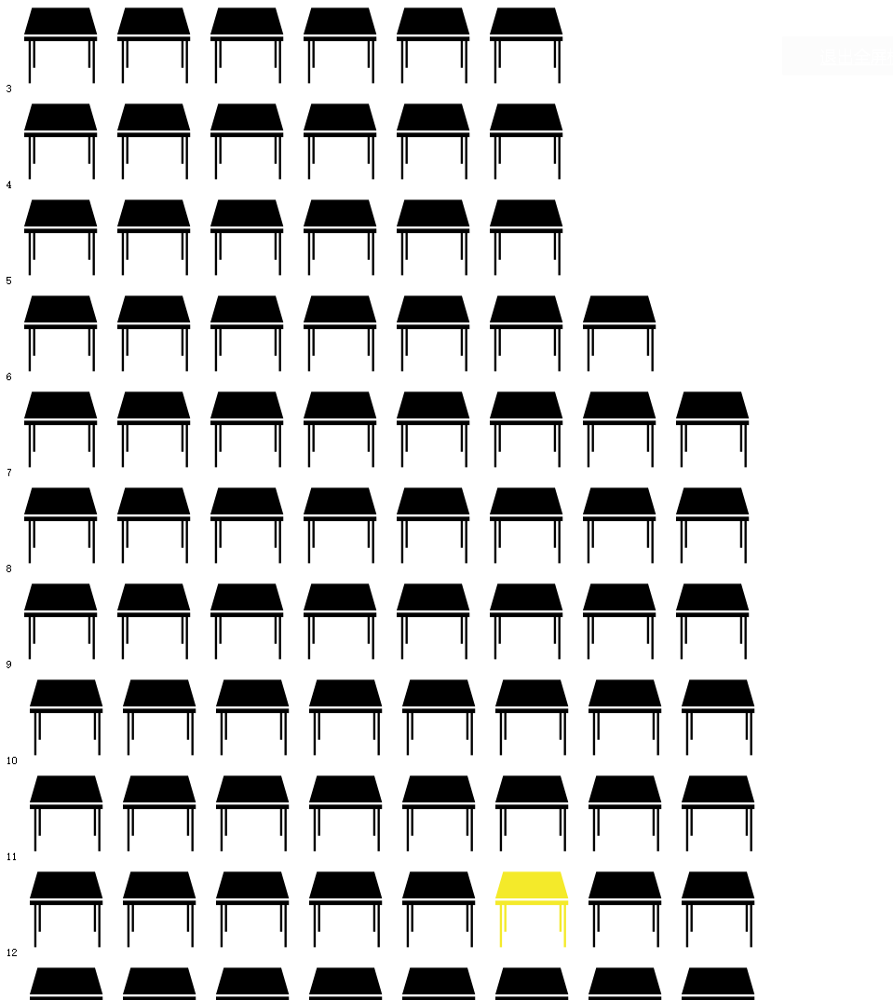
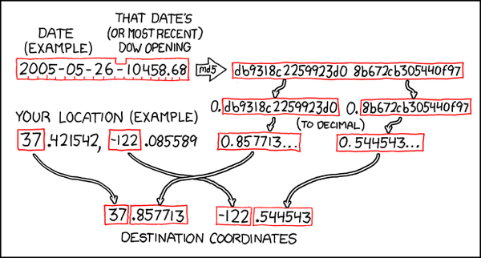

这是一个用于计算ACCP下一次在暨南大学珠海校区饭堂二楼聚会地点的程序 
-------
*1.运行环境 
        wampserver集成环境
        apache---》2.4.9 
        MySQL---》5.6.17 
        PHP---》5.5.12 
- - -  
*2.运行结果
        
 - - - 
*3.运行流程 
        a.获取腾讯香港股市开盘价
        ps：由于黄某太懒，最后是通过百度粑粑提供的股价查询api获取当天腾讯开盘价 
        地址：https://www.juhe.cn/docs/api/id/21
        b.将当天日期和开盘价之和用MD5加密，获得32位字符串，平均分成4份；分别为首选位置的行和列与备选位置的行与列 
         
        c.每份8位数的字符串转位十进制然后每位数相加求和，然后通过form函数强制转换为符合实际行列数范围的值（这部分很勉强导致1-9行几乎没机会轮上，后面要修改） 
        d.得到行列号后返回一个与实际位置相同的二维数组，1为选中位置，0为未选中位置 
        e.在HTML中遍历该二维数组，0输入灰色桌子，1输出黄色桌子 
- - - 
*4.槽点 
        a.之前用太多框架，突然PHP文件怎么输出变量到HTML文件忘记了。。。 
        b.虽然放假有7天，但是惰性难除和手头杂事的确有点多，最后还是决定一件一件来（哈哈，我干嘛说这些没用的） 
        c.UI还是很丑，没有自适应，也是下一步要改进的。