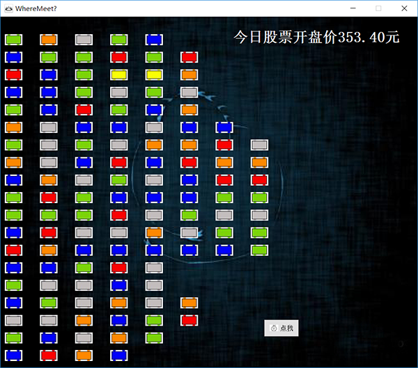
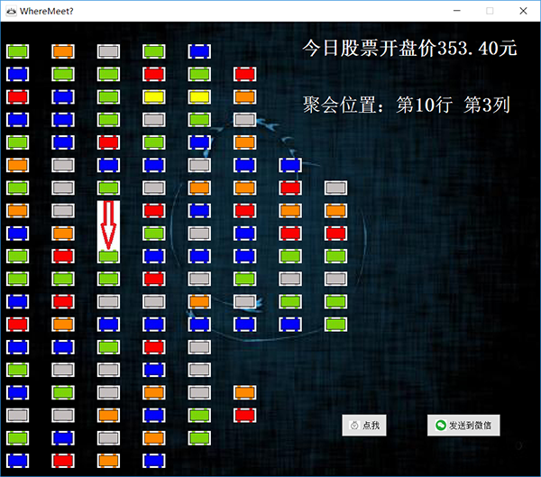
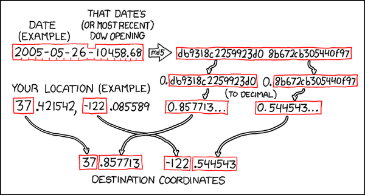
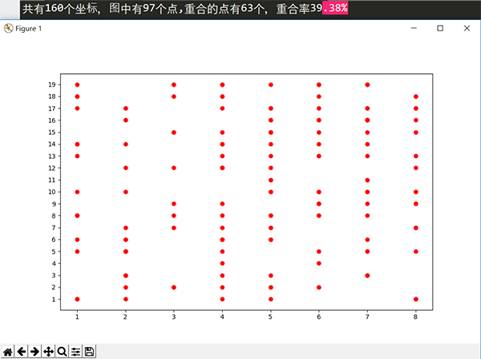
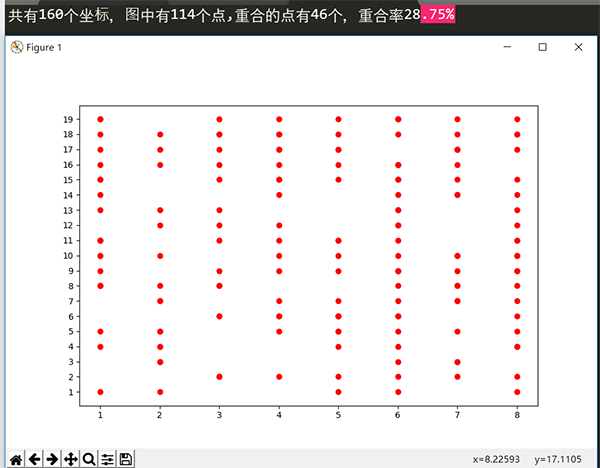

# ACCC-Club聚会地点计算程序
*BTW: 聚会地点是基于饭堂二楼的...*

### 运行环境
+ python 3.6.2
+ 需要的模块 PyQt5, requests, itchat
+ 运行分辨率 1920*1080 （有可能会影响显示）

### 运行

### 完成的功能
+ 获取当日腾讯控股(00700)开盘价

+ md5值生成，最终行列生成的处理

+ 丑陋的UI界面(被迫的接触了PyQt5, 所以代码上可能很乱)

+ UI界面中的桌子的排布可以修改config.txt来修改，可以修改颜色，一个空格是一个间隔，多个空格可以空的更开。方便了桌子的增加，删除，修改

+ 微信发送消息功能
    + ~~（itchat模块有一个问题,必须登录微信,不然会陷入死循环,未解决该问题）~~
    + 解决微信登录问题，利用线程+信号-槽机制解决(线程内来开微信，信号-槽来发送错误信息到主线程，因为PyQt5 GUI限制在主线程中调用)

+ 网络异常的捕获及处理

+ 重写itchat登录过程
    - 重写微信登录函数
    - 由于itchat自动登录 虽然异常处理我都捕获并处理了
    - 但是还是存在当我网络正常，但是不想登录或者不想扫二维码而把二维码关闭时
    - 此时wechat发消息这个线程是陷入死循环的，是一直等待你去登录微信
    - 如果只是一条线程倒是无所谓， 但是你多次按了微信发送消息的按钮，却不登录
    - 会开了很多条线程，十分浪费系统资源
    - 所以重写了itchat登录的过程

### 生成过程
+ 参考了这幅图，除了生成行号和列号与下同不同外，其余基本相似

+ 根据‘当天日期+聚会当天腾讯控股 (00700)的开盘价’构成的字符串生成md5值
+ 然后将所得的md5值平均分成两部分，并转换为10进制
+ 分别求所得的两部分的所有数位和 A, B (数位和+偏移值，加偏移值为了使点分布更均匀)
+ A %= 总共的行数 得聚会位置的行号
+ B %= A求出来的行的总共列数 得聚会位置的列号

### 关于偏移值(test文件夹就是找偏移量的)
+ 因为单纯的对生成的十进制数 所有数位求和再取余所得的分布可能并不是那么均匀
+ 不过寻找合适的偏移量的过程，可能存在玄学的影响，毕竟160个开盘价的数据量并不是那么大
+ 找到的偏移量可能仅适合这160个数据。（有带考察，如果是真的，那就要改变生成行列的算法了）
+ 不加偏移量时，160个开盘价所得的散点图如下：

    

+ 在1到10w的范围内找到偏移量27666使得加上偏移量后点分布均匀度提高

    

### 吐槽
+ Qt将所有GUI相关的处理都限制在主线程中，这么做有助于防止意想不到的访问冲突产生，但也限制了线程中某些简单的UI交互的实现，比如QMessageBox。 因为这个原因...傻傻地弄了n个小时！！
+ 使用信号-槽来解决itchat不登录的问题，emmmm,玄学,一下午试了线程间信号-槽来发送消息总是奔溃，结果晚上重写一遍就可以了
+ oh, 还有一点，一条线程只能用一次, 所以得重新构建

